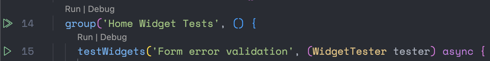
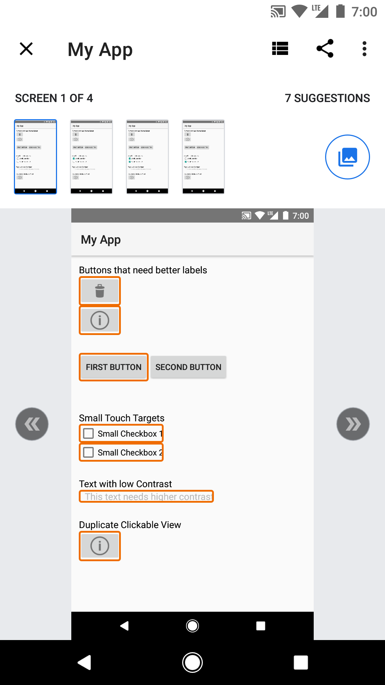

## Philosophy

- Code is organic, and changes frequently, so as a team we should be aligned on how it grows, and is maintained. The base architecture should be built keeping [SOLID](https://www.digitalocean.com/community/conceptual-articles/s-o-l-i-d-the-first-five-principles-of-object-oriented-design) in mind. Allowing for flexibility when needed, but also dependable. It should be easy for newer people to ramp up, because no one likes to spend a month just to start contributing. Everyone has ownership of the codebase. Take a look [here](https://www.tatvasoft.com/outsourcing/2022/05/software-development-principles.html) for more direction!
- All ideas are welcomed, and no one person should override the consensus. Change is inevitable, so be flexible to change! Make sure to keep constant communication with your teammates, and any large sweeping changes should have an RFC in Confluence

## Getting Started With Flutter

If this is your first flutter project, don't worry, we will help you through it! Below are some great resources to get caught up to speed

- [Lab: Write your first Flutter app](https://docs.flutter.dev/get-started/codelab)
- [Cookbook: Useful Flutter samples](https://docs.flutter.dev/cookbook)

For help getting started with Flutter development, view the[online documentation](https://docs.flutter.dev/), which offers tutorials,
samples, guidance on mobile development, and a full API reference.

## Architecture

Our architecture stems from [Flutter - Clean Architecture](https://github.com/guilherme-v/flutter-clean-architecture-example). We found this architecture to allow for ease of use and flexibility. You should be in good hands with it's documentation. Any changes we make that diverge from the proposed architecture should be noted here.

## Libraries and Frameworks Used

- State Management: [Flutter Riverpod](https://riverpod.dev/)
- Navigation: [go_router] (https://pub.dev/packages/go_router)
- Fonts: [Google Fonts](https://pub.dev/packages/google_fonts)
- Change App Package Name: [Name Change](https://pub.dev/packages/change_app_package_name) Allows you to change the project name through terminal instead of doing it manually. Feel free to remove it after forking!
- Secret Management: [Envied](https://pub.dev/packages/envied)

## Style Guide

- Lint has been set to the [default](https://dart.dev/effective-dart/style) for Flutter/Dart. Feel free to make your own changes
- Naming Conventions:
  - Screens are the widgets you will display to the user and navigate to and from.
  - ScreenStates are the data that backs the Screens
  - Notifiers are the glue connecting state change and the UseCases
  - UseCases contain the core business logic and coordinate the flow of data between the notifier and repositories
  - Repositories are in charge of doing some sort of specialty work (Network, Cache, Etc)

## Navigation

go_router is a declarative routing package helpful for advanced navigation requirements (such as a web app that uses direct links to each screen or an app with multiple "navigation graphs" or navigation widgets). This package was mentioned here in the flutter docs: https://docs.flutter.dev/ui/navigation

## Secrets

Secrets are managed using the [Envied](https://pub.dev/packages/envied) dart package. Developers are expected to provide a `.env` file at the root of the project to be used by Envied. Envied works by generating a class which can then be used to access the values of the keys within the env file. To generate or update the class, run the following commands:

  `flutter pub run build_runner clean && flutter pub run build_runner build --delete-conflicting-outputs`

An example of how Envied is used can be found at `/lib/env/env.dart`

**Note** 
  1. The generated files for Envied do not get committed so that the secrets are not in source control
  2. Any time you make a change you need to your env you need to rerun the build runner so its picked up ([this is an open issue](https://github.com/petercinibulk/envied/issues/6) right now for Envied)
  3. The first time you run the build-runner with Envied you have to comment out the env.dart file, run the build runner, then uncomment the file and run again ([there is also an open issue](https://github.com/petercinibulk/envied/issues/59) on this )

## How and What Do We Test?
Testing is being run primarily using VSCode. Extensions that help make testing possible include:
- [Dart language extension](https://marketplace.visualstudio.com/items?itemName=Dart-Code.dart-code)
- [Flutter support extension](https://marketplace.visualstudio.com/items?itemName=Dart-Code.flutter)

The flutter support extension should allow you to run tests in VSCode.

To run a test using VSCode, navigate to your test file in the explorer tab and open it. You can run each test via the play button found in the line number column, or by clicking run above a test. All tests in this repo are part of a "group", so to run all tests in a test file, you can click the play button at the start of a group. (Please see screenshot above)

This project follows the Page Object Model structure, with each screen having a separate file that defines all screen elements for reuse in all test files. For example, in the test/screens directory, we have a file titled "home_screen.dart" that should contain all variable declarations or possible reusable functions related to just the homescreen. The hope is that by organizing the project this way, we can avoid repeated code, increase readbility, and make our test code easier to maintain if an element ever changes. To build on the previous example, you can see that both the homescreen integration tests, and homescreen widget tests import and use the homescreen.dart file. 
For more information on the Page Object Model, please visit this [helpful page](https://www.geeksforgeeks.org/page-object-model-pom/).

### Integration Testing:
These tests are designed to be more exhaustive and robust, testing the logic of the application and ensuring the correct scenarios are occuring as expected. These tests are meant to assert on end2end user journeys laid out in Acceptance Criteria. Meaning, these tests will complete a certain scenario in the app from start to finish. 
For example, with a login screen, an integration test might involve inputting valid credentials into the email and password fields, hitting the login button, and asserting that login was successful. Or, it may involve entering invalid credentials, and asserting the users login attempt was unsuccessful. 
Flutter Integration tests build the full application on an emulated device or browser. Because of this increased overhead, these tests are suggested to be run less often than widget and unit tests, especially on a CI/CD pipeline where proper infrastructure for supporting this can be costly. 
For more information, please see the official flutter docs related to [Integration Testing](https://docs.flutter.dev/testing/integration-tests).

### Widget Tests:
These tests are designed to be lightweight and focus on asserting on the hierarchy of the application, and the widgets contained within it. The core difference between widget tests and integration tests, is that these tests are run without the need to build and emulate your application. This can save valuable time on a CI/CD pipeline. Due to their lightweight and quick-to-run nature, these are the ui related tests that are best suited to run as part of the PR verification process.
For more information, please see the official flutter docs related to [Widget Testing](https://docs.flutter.dev/cookbook/testing/widget/introduction).

### Unit Tests:
These tests are described by the flutter documentation as verifying "the behavior of a method or class". These tests are the most lightweight of the three, and don't verify any visual elements. Instead, these tests are meant to assert on the logic of a single method or overall class, and ensure it returns the value we expect. These tests are also meant to be run as part of PR verification, as they help make sure that the app is still functioning as expected after changing a functionality.
For more information, please see  the official flutter docs related to [Unit Testing](https://docs.flutter.dev/cookbook/testing/unit/introduction)

### Accessibilty Tests
Android has an app called [Android Accessibility Scanner](https://play.google.com/store/apps/details?id=com.google.android.apps.accessibility.auditor&hl=en_US&gl=US) that can be used to perform automated accessibility audits. This app is only able to be installed and used on a physical Android device, due to android emulators lack of access to the play store. This app highlights parts of the app that don't fit into standard accessibilty guidelines.

iOS has access to a UI Test class called performAccessibilityAudit that can be performed with an emulator via XCTest. The console output will dispaly any issues found while the audit was performed. The Accessiblity Audit is based on [Apple's Accessiblity best practices](https://developer.apple.com/documentation/xctest/xcuiapplication/4191487-performaccessibilityaudit).

### Mockito:
The Mockito flutter package (https://pub.dev/packages/mockito) in combination with the build-runner will create generated files with mocked class code. For example, in the home_page_state_notifier_test the repository class is annotated above the test as a class that requires a mock. The behavior needs to be defined for the mocked method (ex. getRandomRecipes is defined with a .thenAnswer). A provideDummy is also required in cases where the return type is a generic and your test is expecting an explicit return type. The build runner will auto-generate the corresponding mock with a class that ends with "mocks.dart".

### Folder Structure
This project uses a silightly different folder structure for tests than the official flutter docs. We have opted to mirror the folder structure of the greater application, to make it easier for both developers and test engineers to contribute, and find what they are looking for.

The test folder structure suggested by the flutter documentation can be found [here](https://docs.flutter.dev/testing/integration-tests)):

### Analytics Platforms
This project provides an abstract class to support multiple Analytics platforms, the class can be found at `lib/domain/repository/analytics_repository.dart`. Users are expected to provide implementations for `logEvent, setUserProperties, and screenView` and instantiate the class in `lib/data/repository/analytics/analytics_repository_impl.dart`. The presentation layer can access analytics via the `analyticsProvider` defined in the providers file. 
